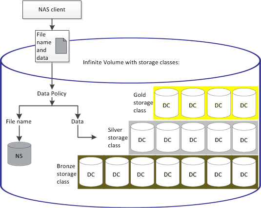

= Infinite Volumeに書き込まれたデータがデータポリシーでフィルタリングされる仕組み
:allow-uri-read: 
:icons: font
:imagesdir: ../media/

[role="lead"]
データポリシーは、Infinite Volumeに書き込まれたデータを複数のストレージクラスに自動的にフィルタリングします。Infinite Volumeのネームスペースにある単一のファイルシステムにすべてのファイルが書き込まれ、データポリシーのルールによって、ファイルのデータがどのストレージクラスに格納されるかが決まります。

Infinite Volumeを作成すると、Infinite Volumeを備えたStorage Virtual Machine（SVM）に対して自動的にデフォルトのデータポリシーが作成されます。このデータポリシーはアクティブで、デフォルトルールを含んでいます。デフォルトルールでは、Infinite Volumeにストレージクラスが含まれるかどうかに応じて、次のようにファイルの受信データが格納されます。

|===
| Infinite Volumeの場合 | デフォルトのデータポリシーによる処理 

 a| 
ストレージクラスを含まない
 a| 
Infinite Volumeにファイルの受信データをすべて配置します

 a| 
ストレージクラスが1つ
 a| 
ファイルの受信データをすべてストレージクラスに配置します

 a| 
ストレージクラスが1つ以上含まれている必要があります
 a| 
最初に作成されたストレージクラスにファイルの受信データをすべて配置します

|===
[NOTE]
====
Infinite Volumeに複数のストレージクラスが含まれる場合は、データポリシーできるだけ早く を変更して、ファイルタイプに応じてデータをフィルタリングして異なるストレージクラスに分類するルールを作成する必要があります。データポリシーの変更にはUnified Managerを使用してください。

====
データポリシーは、Infinite Volumeのネームスペースにあるファイルシステム内のファイルの場所には影響しません。また、ストレージクラスはクライアントアプリケーションに対して透過的です。ネームスペース内のファイルシステムには、ファイル名が含まれています。データポリシーが影響するのは、ファイルのデータがどのストレージクラスに格納されるかということだけです。データポリシーは、複数のストレージクラスをInfinite Volumeに割り当てる場合に役立ちます。

追加のルールはデータポリシーを変更して作成できますが、データポリシーやそのデフォルトルールを削除することはできません。

次の図は、Infinite Volumeのデータがデータポリシーでフィルタリングされる仕組みを示しています。ファイル名はネームスペースコンスティチュエントに格納され、データポリシーのルールによって、この特定ファイルのデータがsilverストレージクラスに格納されるように指定されます。

