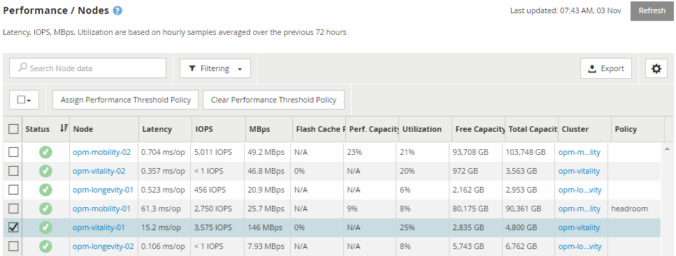

= パフォーマンスインベントリページを使用したパフォーマンスの監視
:allow-uri-read: 
:icons: font
:imagesdir: ../media/

[role="lead"]
オブジェクトインベントリパフォーマンスページには、オブジェクトタイプカテゴリ内のすべてのオブジェクトのパフォーマンス情報、パフォーマンスイベント、およびオブジェクトの健全性が表示されます。すべてのノードやすべてのボリュームなど、クラスタ内の各オブジェクトのパフォーマンスステータスの概要が一目でわかります。

オブジェクトインベントリのパフォーマンスページでは、オブジェクトステータスの概要を確認し、すべてのオブジェクトの全体的なパフォーマンスを評価してオブジェクトのパフォーマンスデータを比較できます。オブジェクトインベントリページの内容を絞り込むには、検索、ソート、フィルタリングを実行します。パフォーマンスの問題があるオブジェクトをすばやく特定してトラブルシューティングプロセスを開始できるため、オブジェクトのパフォーマンスを監視および管理する場合に便利です。

パフォーマンスインベントリページのオブジェクトは、デフォルトでは、オブジェクトのパフォーマンスの重大度に基づいてソートされます。新しい重大なパフォーマンスイベントが報告されたオブジェクトが最初に表示され、そのあとに警告イベントが報告されたオブジェクトが表示されます。これにより、対処が必要な問題を簡単に特定できます。パフォーマンスデータはいずれも 72 時間の平均値です。

オブジェクト名の列でオブジェクト名をクリックすると、オブジェクトインベントリパフォーマンスページからオブジェクトの詳細ページに簡単に移動できます。たとえば、Performance/Nodesインヘントリヘエシで、* Nodes *列のノードオブジェクトをクリックします。オブジェクトの詳細ページには、アクティブなイベントを並べた比較など、選択したオブジェクトの詳細情報が表示されます。
