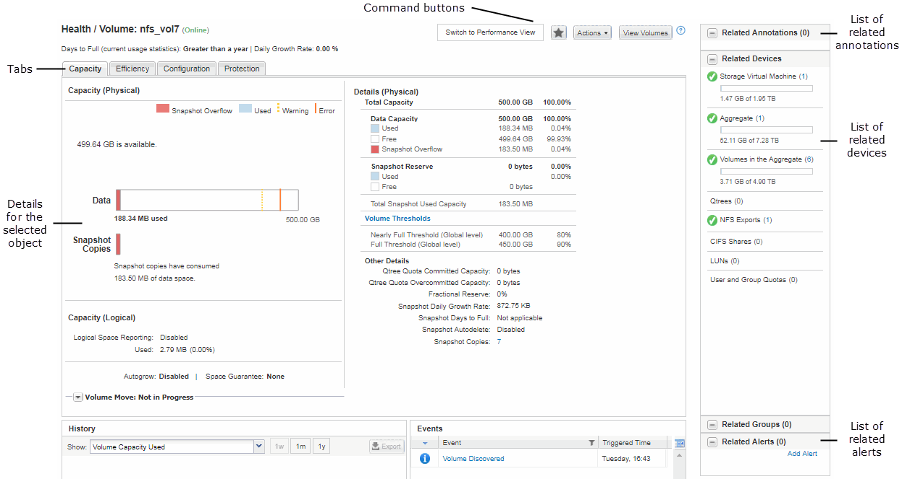

= 一般的なウィンドウレイアウト
:allow-uri-read: 
:icons: font
:imagesdir: ../media/

[role="lead"]
一般的なウィンドウレイアウトを理解しておくと、OnCommand Unified Managerを効果的に操作して使用できるようになります。Unified Manager のほとんどのウィンドウは、オブジェクトリストまたは詳細の 2 つの一般的なレイアウトの 1 つに似ています。推奨される表示設定は 1280 × 1024 ピクセル以上です。

次の図のすべての要素がすべてのウィンドウに含まれているわけではありません。

== オブジェクトリストウィンドウのレイアウト

image::../media/object-list.gif[オブジェクトリスト]

== オブジェクト詳細ウィンドウのレイアウト

