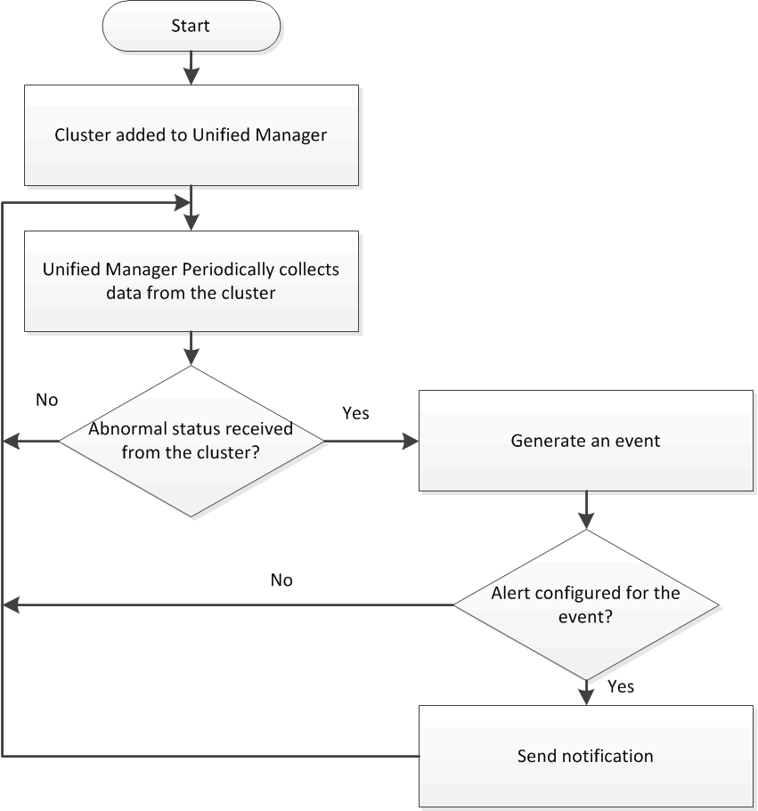

= クラスタの監視の概要
:allow-uri-read: 
:icons: font
:imagesdir: ../media/

[role="lead"]
Unified Manager データベースにクラスタを追加して、クラスタの可用性や容量などの詳細を監視できます。 CPU 使用率、インターフェイスの統計、空きディスクスペース、 qtree 使用率、シャーシの環境などが監視されます。

ステータスが異常な場合や事前定義されたしきい値を超えた場合は、イベントが生成されます。イベントによってアラートがトリガーされたときに指定した受信者に通知を送信するように Unified Manager を設定することもできます。

次のフローチャートは、Unified Managerの監視プロセスを示しています。

