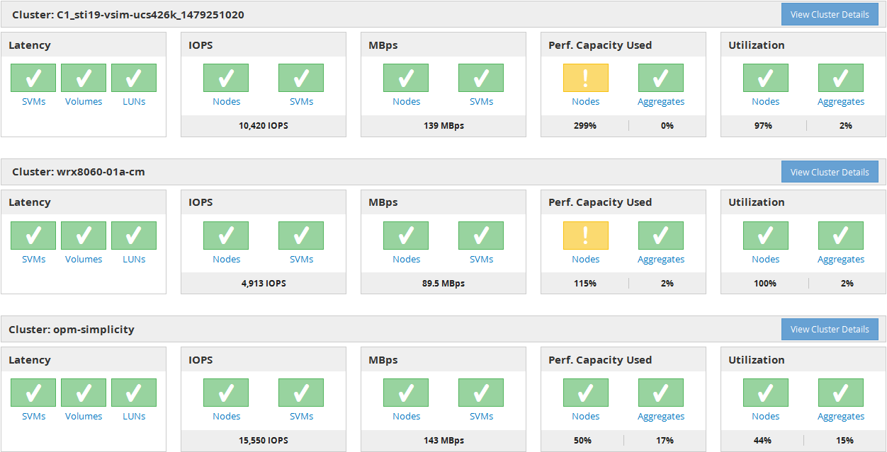

= パフォーマンスダッシュボードについて
:allow-uri-read: 
:icons: font
:imagesdir: ../media/

[role="lead"]
Unified ManagerのPerformance Dashboardには、環境内の監視対象のすべてのクラスタのパフォーマンスステータスの概要が表示されます。パフォーマンスの問題が発生しているクラスタは、重大度順にページの上部に表示されます。ダッシュボードの情報は、5分間のパフォーマンス収集期間ごとに自動的に更新されます。

次の図は、2つのクラスタを監視しているUnified ManagerのPerformance Dashboardを示しています。

ストレージオブジェクトを表すステータスアイコンは重大度の高いものから低いものへとソートした次のいずれかの状態になります。

* 重要（image:../media/sev-critical-um60.png["重大度が「重大」のイベントのアイコン"]）：オブジェクトに対して1つ以上の新しい重大なパフォーマンスイベントが報告されています。
* 警告（image:../media/sev-warning-um60.png["重大度が「警告」のイベントのアイコン"]）：オブジェクトに対して1つ以上の新しい警告パフォーマンスイベントが報告されています。
* 標準（image:../media/sev-normal-um60.png["重大度が「 Normal 」のイベントのアイコン"]）：オブジェクトに対して新しいパフォーマンスイベントは報告されていません。

[NOTE]
====
色は、オブジェクトに新しいイベントが存在するかどうかを示します。アクティブではなくなったイベントは廃止イベントと呼ばれ、アイコンの色には影響しません。

====

== クラスタのパフォーマンスカウンタ

クラスタごとに次のパフォーマンスカテゴリが表示されます。

* レイテンシ
+
クライアントアプリケーションの要求に対するクラスタの応答速度が処理あたりのミリ秒数で表示されます。

* IOPS
+
クラスタの処理速度が1秒あたりの入出力処理数で表示されます。

* MBps
+
クラスタとの間のデータの転送量が1秒あたりのメガバイト数で表示されます。

* 使用済みパフォーマンス容量
+
使用可能なパフォーマンス容量を過剰に消費しているノードまたはアグリゲートがないかが表示されます。

* 利用率
+
リソースの利用率が高いノードまたはアグリゲートがないかが表示されます。

クラスタとストレージオブジェクトのパフォーマンスを分析するには、次のいずれかを実行します。

* クラスタの詳細の表示*をクリックすると、クラスタランディングページが表示され、選択したクラスタとストレージオブジェクトの詳細なパフォーマンスとイベント情報を確認できます。
* オブジェクトの赤または黄色のステータスアイコンをクリックすると、そのオブジェクトのインベントリページが表示され、ストレージオブジェクトの詳細を確認できます。
+
たとえば、ボリュームアイコンをクリックすると、パフォーマンス/ボリュームインベントリページが表示され、選択したクラスタ内のすべてのボリュームのリストが、パフォーマンスが最大になるように順にソートされて表示されます。

