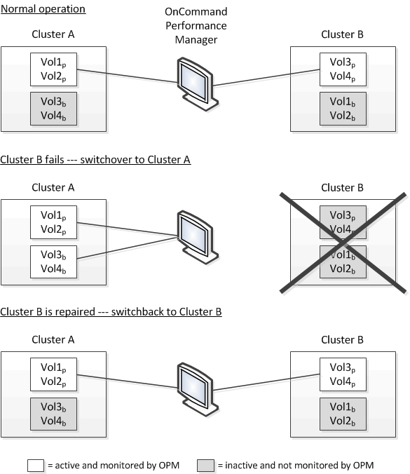

= スイッチオーバーおよびスイッチバックの発生時のボリュームの動作
:allow-uri-read: 
:icons: font
:imagesdir: ../media/

[role="lead"]
スイッチオーバーまたはスイッチバックをトリガーするイベント。原因アクティブボリュームをディザスタリカバリグループ内の一方のクラスタからもう一方のクラスタに移動します。クライアントにデータを提供していたアクティブなクラスタのボリュームは停止され、もう一方のクラスタのボリュームがアクティブ化されてデータの提供が開始されます。Unified Manager では、実行中のアクティブなボリュームのみが監視されます。

ボリュームが一方のクラスタからもう一方のクラスタに移動されるため、両方のクラスタを監視することを推奨します。Unified Manager では単 MetroCluster 一のインスタンスで両方のクラスタを監視できますが、監視する 2 つのクラスタ間の距離によっては、両方のクラスタを監視するために Unified Manager インスタンスが 2 つ必要になる場合があります。次の図は、 Unified Manager の単一のインスタンスを示しています。

名前に「 p 」が付いているボリュームはプライマリボリュームで、「 b 」が付いているボリュームは SnapMirror で作成されたミラーバックアップボリュームです。

通常運用時：

* クラスタ A には、 Vol1p と Vol2p の 2 つのアクティブボリュームがあります。
* クラスタ B には、 Vol3p と Vol4p の 2 つのアクティブボリュームがあります。
* クラスタ A の 2 つのボリュームが非アクティブ： Vol3b と Vol4b
* クラスタ B の 2 つのボリュームが非アクティブ： Vol1b および Vol2b

Unified Manager によって、アクティブなボリュームのそれぞれに関する情報（統計やイベントなど）が収集されます。Vol1p および Vol2p の統計情報はクラスタ A によって収集され、 Vol3p および Vol4p の統計情報はクラスタ B によって収集されます

重大な障害が発生してアクティブなボリュームがクラスタ B からクラスタ A にスイッチオーバーされると次のようになります。

* クラスタ A には、 Vol1p 、 Vol2p 、 Vol3b 、 Vol4b の 4 つのアクティブボリュームがあります。
* クラスタ B の 4 つのボリュームが非アクティブ： Vol3p 、 Vol4p 、 Vol1b 、 Vol2b 。

通常運用時と同様に、 Unified Manager でアクティブなボリュームのそれぞれに関する情報が収集されます。ただし、この場合は、クラスタ A によって Vol1p および Vol2p の統計情報が収集され、クラスタ A でも Vol3b および Vol4b の統計情報が収集されます

Vol3p と Vol3b は異なるクラスタにあるため、同じボリュームではないことに注意してください。Unified Manager の Vol3p に関する情報は Vol3b とは異なります。

* クラスタ A にスイッチオーバーしている間は、 Vol3p の統計とイベントは表示されません。
* 最初のスイッチオーバーでは、 Vol3b は履歴情報のない新しいボリュームのように見えます。

クラスタ B が復旧してスイッチバックが実行されると、クラスタ B の Vol3p が再びアクティブになり、スイッチオーバー中に過去の統計と統計のギャップが生じます。別のスイッチオーバーが発生するまで、 Vol3b をクラスタ A で表示することはできません。

image::../media/opm-mcc-volumes.gif[OPM の MCC ボリューム]

[NOTE]
====
* スイッチバック後にクラスタ A の Vol3b など、非アクティブな MetroCluster ボリュームは「 This volume was deleted` 」というメッセージで示されます。このボリュームは、実際には削除されていませんが、アクティブなボリュームでないため Unified Manager で現在監視されていません。
* 単一の Unified Manager で MetroCluster 構成の両方のクラスタを監視している場合にボリュームを検索すると、その時点でアクティブなボリュームの情報が返されます。たとえば、「 vol3 」を検索すると、スイッチオーバーが発生し、クラスタ A 上で vol3 がアクティブになった場合に、クラスタ A の Vol3b の統計とイベントが返されます

====