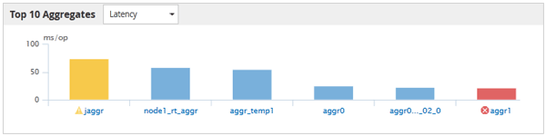

= ハフオオマンスシヨウイヘエシ
:allow-uri-read: 
:icons: font
:imagesdir: ../media/

[role="lead"]
パフォーマンス上位ページには、選択したパフォーマンスカウンタに基づいて、パフォーマンスが最大または最小のストレージオブジェクトが表示されます。たとえば、SVMカテゴリには、IOPSが最大、レイテンシが最大、またはMBpsが最小のSVMを表示できます。また、パフォーマンスが上位のオブジェクトでアクティブなパフォーマンスイベント（新規または確認済みのイベント）が発生しているかどうかも表示されます。

[ パフォーマンスのトップ ] ページには、各オブジェクトの最大 10 個が表示されます。Volumeオブジェクトには、FlexVol とFlexGroup の両方のボリュームが含まれ、FlexGroup コンスティチュエントとInfinite Volumeは含まれません。

* * 時間範囲 *
+
上位のオブジェクトを表示する期間を選択できます。選択した期間環境のすべてのストレージオブジェクトが表示されます。使用可能な時間範囲：

+
** 過去 1 時間
** 過去 24 時間
** 過去 72 時間（デフォルト）
** 過去 7 日間

* * メートル法 *
+
[*Metric] メニューをクリックして別のカウンタを選択します。カウンタのオプションはオブジェクトタイプによって異なります。たとえば、* Volumes *オブジェクトに使用できるカウンタは、* Latency *、* IOPS *、* MBps *などです。カウンタを変更すると、パネルのデータがリロードされ、選択したカウンタに基づいて上位のオブジェクトが表示されます。

+
使用可能なカウンタ：

+
** レイテンシ
** IOPS
** MBps
** 使用済みパフォーマンス容量（ノードとアグリゲートの場合）
** 利用率（ノードとアグリゲートの場合）

* * 並べ替え *
+
[ * 並べ替え * ] メニューをクリックして、選択したオブジェクトとカウンタの昇順または降順の並べ替えを選択します。オプションは、 * highest ~ lowest * および * lowest ~ highest * です。これらのオプションを使用すると、パフォーマンスが高いオブジェクトとパフォーマンスが低いオブジェクトを表示できます。

* * カウンターバー *
+
グラフのカウンタバーには、各オブジェクトのパフォーマンス統計が棒グラフで表示されます。棒グラフは色分けされ、カウンタがパフォーマンスしきい値に違反していない場合は青で表示されます。しきい値の違反がアクティブ（新規または確認済みのイベント）な場合、バーはそのイベントの色で表示されます。警告イベントは黄色（image:../media/treemapstatus-warning-png.gif["TreeMap のアイコン–警告ステータス"]）をクリックすると、重大イベントが赤で表示されます（image:../media/treemapred-png.gif["TreeMap のアイコン–赤色"]）。しきい値の違反は、警告イベントと重大イベントの重大度イベントインジケータアイコンでさらに細かく示されます。

+

+
各グラフの X 軸には、選択したオブジェクトタイプの上位のオブジェクトが表示されます。Y 軸には、選択したカウンタに適用可能な単位が表示されます。各垂直棒グラフ要素の下にあるオブジェクト名のリンクをクリックすると、選択したオブジェクトのパフォーマンスランディングページに移動します。

* * イベントの重大度インジケータ *
+
アクティブなクリティカルのオブジェクト名の左側には、 * 重大度イベント * インジケータアイコンが表示されます（image:../media/sev-critical-um60.png["重大度が「重大」のイベントのアイコン"]）または warning （image:../media/sev-warning-um60.png["重大度が「警告」のイベントのアイコン"]）上位のオブジェクトグラフのイベント。[*Severity Event*] インジケータアイコンをクリックすると、次の項目が表示されます。

+
** * 1 つのイベント *
+
そのイベントのイベント詳細ページに移動します。

** * 2 つ以上のイベント *
+
選択したオブジェクトのすべてのイベントを表示するためにフィルタされたイベントインベントリページに移動します。

* * 「エクスポート」ボタン *
+
を作成します `.csv` カウンタバーに表示されるデータを含むファイル。表示している単一のクラスタについてのファイルのほか、データセンターのすべてのクラスタについてのファイルを作成することもできます。

