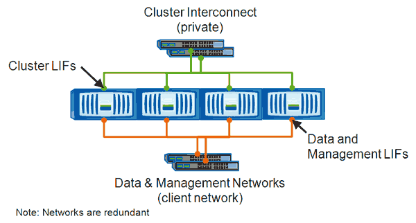

= LIFを手動で移動する
:allow-uri-read: 
:icons: font
:imagesdir: ../media/

[role="lead"]
Storage Virtual Machine（SVM）には、データボリュームと、クライアントへのデータの提供に使用する論理インターフェイス（LIF）が1つ以上含まれています。同じSVM内の物理ポート間でデータLIFを移動することができます。この処理は、負荷分散の改善が必要な場合や、メンテナンス処理やパフォーマンス調整時などに実行します。

== このタスクについて

LIFには次のタイプがあります。

* データLIF：SVMと関連付けて、クライアントとの通信に使用します。
* クラスタ管理LIF：ノード、SVM、およびクラスタ自体の管理に使用します。
* クラスタLIF：クラスタ内のトラフィックに使用します。
* インタークラスタLIF：クラスタ間の通信に使用します。
* クラスタ内LIF：HAペア間の通信に使用します。
* SVM管理LIF：SVMに関連付けられたデータLIFで、SVMの管理に使用します。

このワークフローでは、データLIFの移動方法について説明します。この環境 NAS（NFSおよびCIFS）LIFは、SAN（FCおよびiSCSI）LIFには使用できません。

[NOTE]
====
CIFS共有に接続されているLIFを移動すると、CIFS共有にアクセスするクライアントが切断されます。CIFS共有に対する読み取り要求や書き込み要求はすべて中断されます。

====
[NOTE]
====
CIFS共有に接続されたLIFの移動に関する詳細など、他のタイプのLIFの移動方法については、ONTAP のネットワークに関するドキュメントを参照してください。

====
データLIFに関して、次の基本的な操作を実行できます。

* すべてのデータLIFを表示する
* 最もビジーなLIFを特定する
* ビジーなLIFの移動先に最適なノードを特定する
* LIFのホームポートまたはホームノードを変更して、クラスタ内でのLIFの優先配置先を変更する
+
より長期的な変更が必要な場合は、LIFを移行するのではなく、移動する必要があります。元のホームポートに戻すには、LIFをリバートする必要があります。

* ホームポートやノードに問題がある場合や、定期的なメンテナンス中に使用する一時的な変更のためにデータLIFを別のポートに移行する。
* データLIFをホームポートにリバートする

