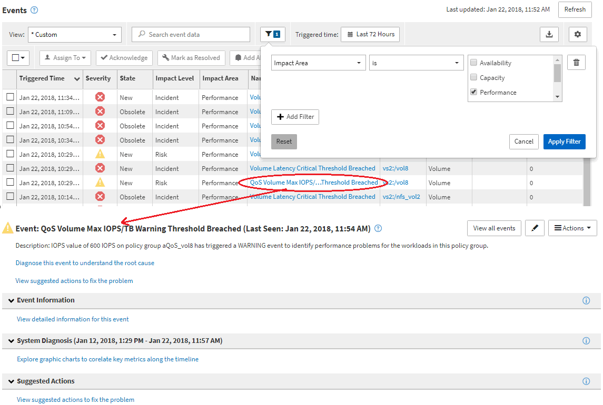

= イベント調査時の画面操作
:allow-uri-read: 
:icons: font
:imagesdir: ../media/

[role="lead"]
Unified Manager のイベント詳細ページには、パフォーマンスイベントに関する詳しい情報が表示されます。トラブルシューティングやシステムパフォーマンスの微調整を行う際に、このページでパフォーマンスイベントを調査できます。

パフォーマンスイベントのタイプに応じて、次のいずれかのイベント詳細ページが表示されます。

* ユーザ定義およびシステム定義のしきい値ポリシーイベントのイベントの詳細ページ
* 動的しきい値ポリシーのイベントの詳細ページ

次に、イベントを調査する際の手順の一例を示します。

. 左側のナビゲーションペインで、 * Events * （イベント * ）をクリックします。
. [イベント]インベントリページで、フィルタボタンをクリックし、[影響領域]で[*パフォーマンス]を選択して、イベントのリストをフィルタリングします。
. 調査するイベントの名前をクリックすると、イベントの詳細ページが表示されます。
. [提案されたアクション]などの領域を展開して、問題 の解決に役立つイベントの詳細を表示します。

