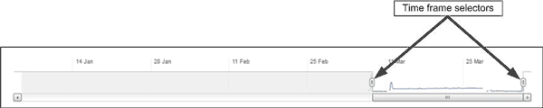

= パフォーマンスデータのグラフの仕組み
:allow-uri-read: 
:icons: font
:imagesdir: ../media/

[role="lead"]
Unified Managerでは、指定した期間のボリュームのパフォーマンス統計やイベントがグラフやチャートで表示されます。

グラフにデータを表示する期間はカスタマイズが可能です。グラフの横軸は期間、縦軸はカウンタを表し、各ポイントのデータが線でつながれて表示されます。縦軸は想定値または実測値の最大値に基づいて動的に調整されます。

== 期間を選択しています

Performance / Volume Detailsページでは、このページのすべてのグラフの期間を履歴データチャートで選択できます。1d、5d、10d、30dの各ボタンで1日から30日（1カ月）を指定し、* Custom *ボタンで30日以内にカスタムの時間範囲を指定できます。グラフの各ポイントは5分間隔で収集されたパフォーマンスデータを表し、最大30日分の履歴データが保持されます。ネットワーク遅延やその他の異常が発生している間隔も含まれていることに注意してください。

この例では、履歴データチャートの期間が3月の最初と最後に設定されています。選択した期間に含まれない3月よりも前の履歴データはすべてグレー表示になります。

== データポイントの情報を表示する

グラフ上でデータポイントの情報を確認するには、グラフ内の特定のポイントにカーソルを合わせます。そのポイントの値と日付および時刻の情報がポップアップボックスに表示されます。

image::../media/opm-chart-popup-png.gif[OnCommand パフォーマンスマネージャのグラフメッセージ]

この例では、パフォーマンス/ボリュームの詳細ページでIOPSチャートにカーソルを合わせると、午前3：50の間の応答時間と処理の値が表示されています午前3時55分までオープン10月20日に。

== パフォーマンスイベントの情報の表示

グラフでイベントの情報を確認するには、イベントアイコンにカーソルを合わせます。イベントの概要情報がポップアップボックスに表示されます。また、イベントアイコンをクリックすると詳細を確認することができます。

image::../media/opm-bully-volume-png.gif[Performance Managerのインシデントのポップアップ]

この例では、パフォーマンス/ボリュームの詳細ページでレイテンシグラフのイベントアイコンをクリックすると、イベントに関する詳細情報がポップアップボックスに表示されます。イベントはイベントリストでも強調表示されます。
