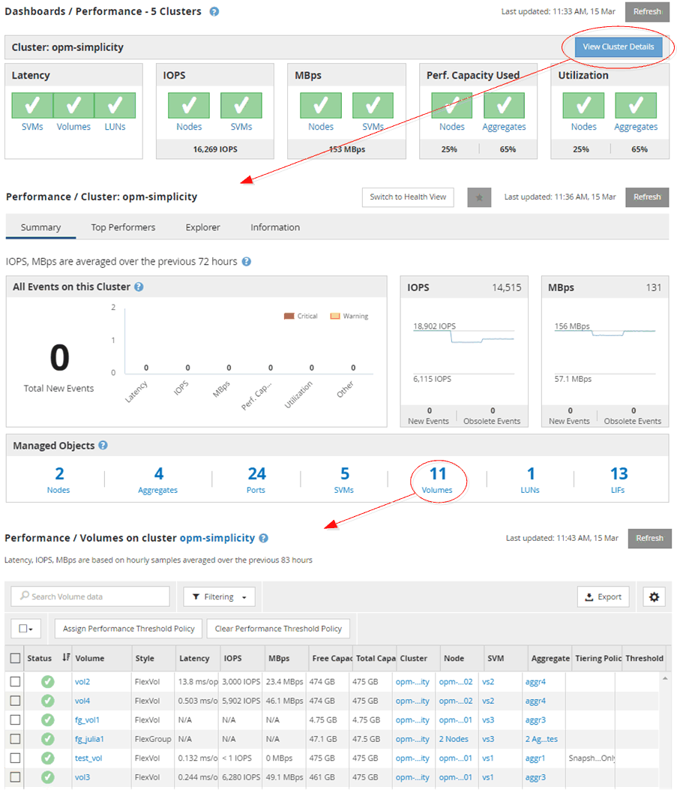

= クラスタオブジェクト監視時の操作
:allow-uri-read: 
:icons: font
:imagesdir: ../media/

[role="lead"]
Unified Managerを使用すると、Unified Managerで管理しているクラスタ内のすべてのオブジェクトのパフォーマンスを監視できます。ストレージオブジェクトの監視では、クラスタとオブジェクトのパフォーマンスの概要を確認し、パフォーマンスイベントを監視します。パフォーマンスとイベントの総合的な情報を表示することも、オブジェクトのパフォーマンスとパフォーマンスイベントの詳しいデータを表示して調査することもできます。

次に、クラスタオブジェクトを監視する際の操作例を紹介します。

. ダッシュボード/パフォーマンスページで、調査するクラスタを特定し、選択したクラスタのランディングページに移動します。
. Performance/ClusterSummaryヘエシで、調査するクラスタオブジェクトを特定し、そのオブジェクトのインベントリページに移動します。この例では、パフォーマンス/ボリュームのインベントリページを表示するために「* Volumes」が選択されています。

