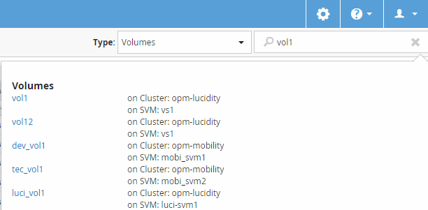

= ストレージオブジェクトを検索しています
:allow-uri-read: 
:icons: font
:imagesdir: ../media/

[role="lead"]
特定のオブジェクトにすばやくアクセスするには、インターフェイスの右上にある「* Search All Storage Objects *」フィールドを使用します。すべてのオブジェクトをグローバルに検索するこの方法を使用すると、特定のオブジェクトをタイプ別にすばやく見つけることができます。検索結果はストレージオブジェクトのタイプ別に表示され、「*タイプ*」ドロップダウンメニューを使用してフィルタできます。検索キーワードは 3 文字以上にする必要があります。

グローバル検索では、検索結果の総数は表示されますが、アクセスできるのは上位20件のみです。そのため、グローバル検索機能は、すばやく検索したい項目がわかっている場合に特定の項目を検索するためのショートカットツールと考えることができます。検索結果をすべて表示するには、オブジェクトのインベントリページで検索を実行するか、関連するフィルタリング機能を使用します。

[*タイプ*（* Type *）]ドロップダウンボックスをクリックし、[*すべて*（* All *）]を選択すると、すべてのオブジェクトとイベントを同時に検索できます。または、[タイプ*（* Type *）]ドロップダウンボックスをクリックして、オブジェクトタイプを指定することもできます。[すべてのストレージオブジェクトの検索]フィールドにオブジェクトまたはイベント名の任意の文字数を入力し、*Enter*キーを押すか、* Search All*をクリックして、次のような検索結果を表示します。

* イベント：パフォーマンスイベントのID
* クラスタ：クラスタ名
* nodes ：ノード名
* アグリゲート：アグリゲート名
* SVMs ： SVM 名
* volumes ：ボリューム名
* LUN ： LUN パス

[NOTE]
====
LIF とポートはグローバル検索バーでは検索できません。

====
この例では、*タイプ*ドロップダウンボックスでボリュームオブジェクトタイプが選択されています。[Search All Storage Objects] フィールドに「 vol 」と入力すると、名前にこれらの文字が含まれるすべてのボリュームのリストが表示されます。オブジェクトの検索では、任意の検索結果をクリックして、そのオブジェクトのパフォーマンスエクスプローラページに移動できます。イベント検索では、検索結果内の項目をクリックすると、 [ イベントの詳細 ] ページが表示されます。

[NOTE]
====
検索結果に同じ名前の複数のボリュームが表示されている場合、関連するクラスタとSVMの名前は表示されません。

====