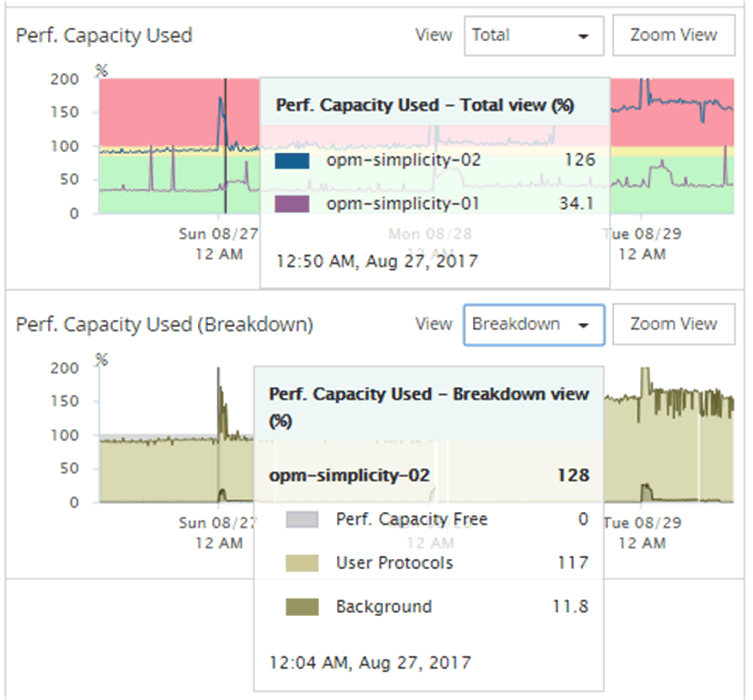

= 問題を特定するためのパフォーマンス容量カウンタグラフの表示
:allow-uri-read: 
:icons: font
:imagesdir: ../media/

[role="lead"]
ノードやアグリゲートの使用済みパフォーマンス容量グラフは、パフォーマンスエクスプローラのページで確認できます。選択したノードとアグリゲートの特定の期間にわたる詳細なパフォーマンス容量データを確認できます。

== このタスクについて

標準のカウンタグラフには、選択したノードまたはアグリゲートの使用済みパフォーマンス容量の値が表示されます。内訳カウンタグラフには、ルートオブジェクトのパフォーマンス容量の値の合計が、ユーザプロトコルとバックグラウンドのシステムプロセスに分けて表示されます。また、空きパフォーマンス容量も表示されます。

[NOTE]
====
システムとデータの管理に関連する一部のバックグラウンドアクティビティはユーザワークロードとみなされ、ユーザプロトコルに分類されるため、これらのプロセスの実行時にはユーザプロトコルの割合が一時的に高く見えることがあります。通常、これらのプロセスはクラスタの使用量が少ない午前 0 時頃に実行されます。ユーザプロトコルのアクティビティが午前 0 時頃に急増している場合は、その時間にクラスタのバックアップジョブまたはその他のバックグラウンドアクティビティの実行が設定されていないかどうかを確認してください。

====

== 手順

. ノードまたはアグリゲートのランディング * ページから * エクスプローラ * タブを選択します。
. カウンタグラフ * ペインで、 * グラフの選択 * をクリックし、 * Perf を選択します。Capacity Used * チャート。
. チャートが表示されるまで下にスクロールします。
+
標準チャートには、最適な範囲内のオブジェクトは黄色、利用率が低いオブジェクトは緑、利用率が高いオブジェクトは赤で表示されます。内訳グラフには、ルートオブジェクトのみの詳細なパフォーマンス容量の詳細が表示されます。

+

. いずれかのグラフをフルサイズで表示する場合は、 * ズームビュー * をクリックします。
+
この方法で、複数のカウンタグラフを別々のウィンドウで開き、使用済みパフォーマンス容量の値を同じ期間に IOPS または MBps の値と比較できます。

